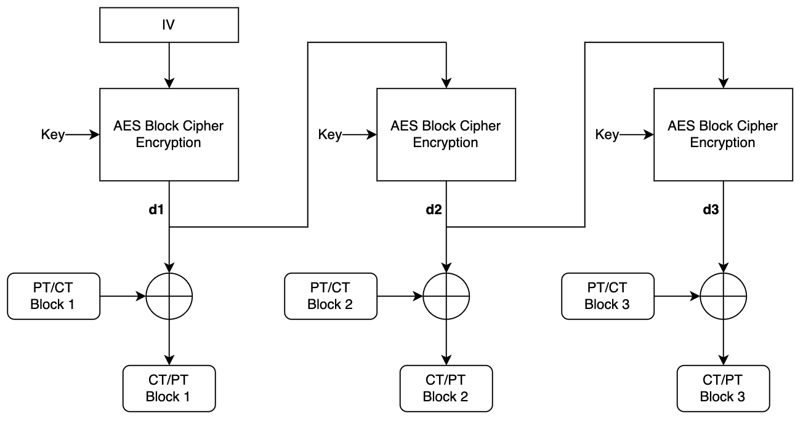
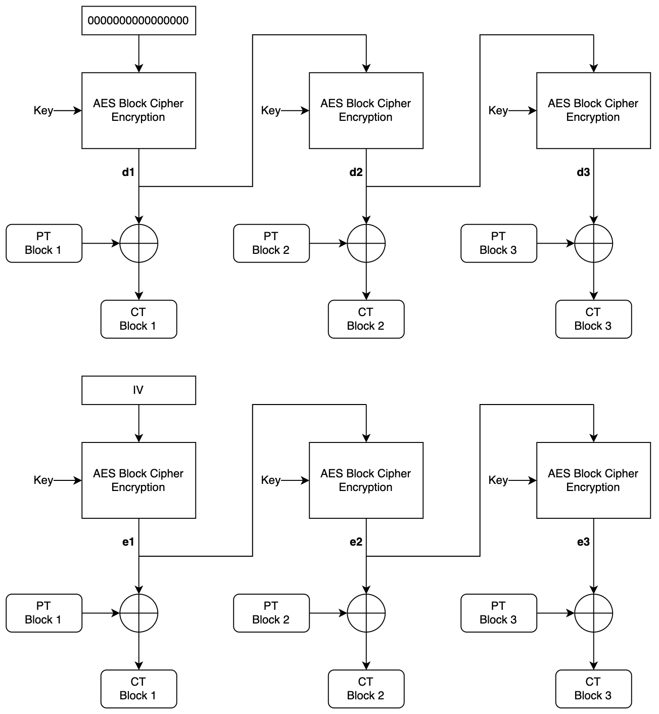
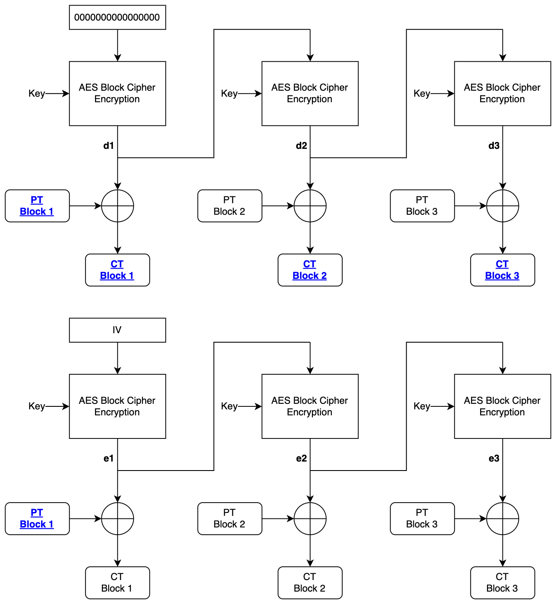
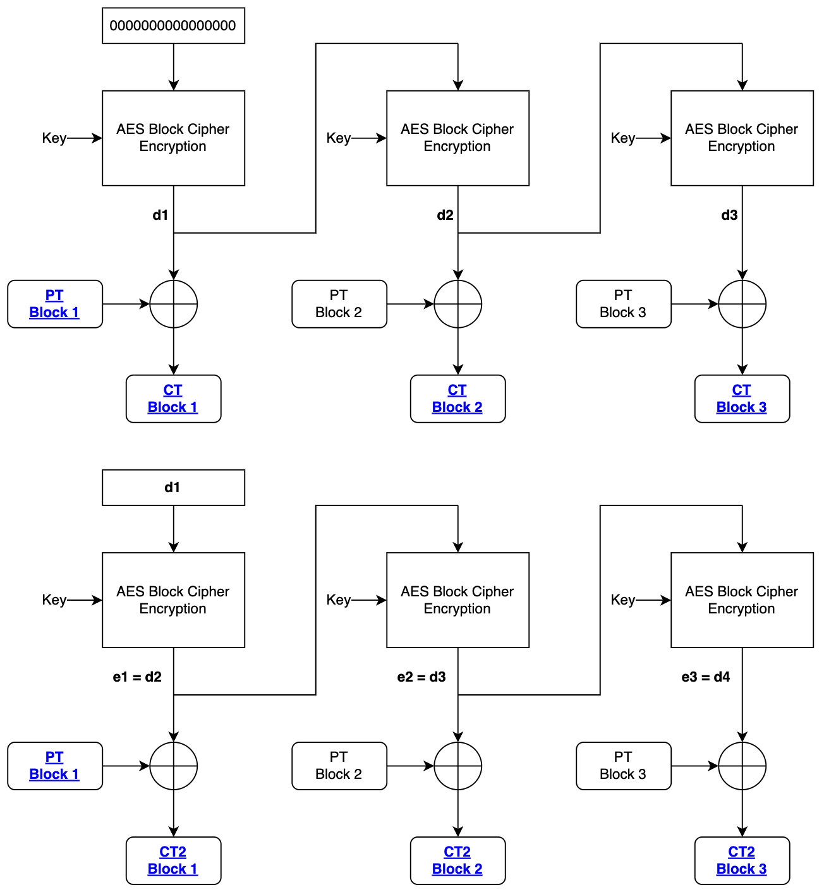

# oracle for block cipher enthusiasts
DownUnder CTF 2022; Crypto (Easy)

Writeup by danlliu from WolvSec (solved)

## General Approach

We are given a string encrypted using AES-OFB, and the opportunity to encrypt it using two different initialization values. Our goal is to utilize the reused key to decrypt the flag!

## Solution

We are given the file `ofb.py`:

```python
#!/usr/bin/env python3

from os import urandom, path
from Crypto.Cipher import AES


FLAG = open(path.join(path.dirname(__file__), 'flag.txt'), 'r').read().strip()
MESSAGE = f'Decrypt this... {urandom(300).hex()} {FLAG}'


def main():
    key = urandom(16)
    for _ in range(2):
        iv = bytes.fromhex(input('iv: '))
        aes = AES.new(key, iv=iv, mode=AES.MODE_OFB)
        ct = aes.encrypt(MESSAGE.encode())
        print(ct.hex())


if __name__ == '__main__':
    main()
```

After looking at this file for a bit, two things stand out; one relatively obvious, one a little more nuanced:
1. The _same_ key is reused twice for encryption, and we are free to choose the initialization value.
2. The first part of the message (`Decrypt this... `) is always the same, and the length of this segment is 16 characters = 16 bytes = **1 AES block**.

### AES-OFB

The AES cipher can be run in various modes, such as ECB, CBC, and GCM modes. In this case, AES is run using the OFB (output feedback) mode. The operation of AES-OFB is shown below:



In essence, an initialization value is passed into the AES block cipher, with the output of the cipher used as the initialization value for the next block. This turns the block cipher into a stream cipher generator, with each output being XORed with the plaintext block. To decrypt this, the initialization value is used alongside the key to regenerate the stream, and the ciphertext blocks are XORed with the stream values to give the plaintext.

Let's think about the challenge again... we're given two opportunities to specify an initialization value. Our first initialization value can be arbitrary; we don't have any information whatsoever. Let's just pick `0x00000000000000000000000000000000`. We can think about our two ciphers as shown below:



Now, we want to determine what value to use for the second IV. At this point, we can think about what information we know. We know the first block of plaintext, since that is `Decrypt this... `. Additionally, we know all the ciphertext blocks for `IV = 000...000`. Let's mark these as bolded blue on our diagram.



From here, we recognize that we can utilize `PT Block 1` and `CT Block 1` to calculate the value of `d1`. However, without knowing the key, we can't calculate `d2` to decrypt further. This is where our chosen initialization value comes into play. Let's set `IV2 = d1`:



Now, notice that we are able to calculate `e1 = d2` from `PT Block 1` and `CT2 Block 1`. From here, we have `d2`, meaning that we can decrypt `PT Block 2` using `CT Block 2` XOR `d2`. Thus, `PT Block 2` becomes known, allowing us to calculate `e2 = d3` from `PT Block 2` and `CT2 Block 2`. We can continue this process to finish decrypting the message.

We can write this process in Python:

```python
import sys

from pwn import *


CRIB = b'Decrypt this... '

def get_zero_message():
    # conn = process('run_ofb')
    conn = remote('2022.ductf.dev', 30009)
    conn.sendline(b'0'*32)
    result = conn.recvline()[4:].decode()
    result = bytes.fromhex(result)
    return result, conn

def get_message(conn, iv):
    conn.sendline(iv.hex().encode())
    result = conn.recvline()[4:].decode()
    result = bytes.fromhex(result)
    return result

def xor_str(a, b):
    return bytes(x^y for x, y in zip(a, b))

def decrypt():
    ZERO_MESSAGE, conn = get_zero_message()

    print(ZERO_MESSAGE[0:16].hex())
    print(CRIB.hex())
    iv = xor_str(ZERO_MESSAGE[0:16], CRIB)
    print(iv.hex())

    IV_MESSAGE = get_message(conn, iv)

    print("Z", ZERO_MESSAGE.hex())
    print("I", IV_MESSAGE.hex())

    DECRYPTED_ZERO = [CRIB]
    ZERO_IVS = [bytes.fromhex('0'*32), iv]

    for block in range(1, len(ZERO_MESSAGE) // 16 + 1):
        print(block)
        IV_BLOCK_PT = DECRYPTED_ZERO[block - 1]
        IV_BLOCK_CT = IV_MESSAGE[block*16-16:block*16]
        NEXT_IV = xor_str(IV_BLOCK_PT, IV_BLOCK_CT)
        ZERO_BLOCK_CT = ZERO_MESSAGE[block*16:block*16+16]
        ZERO_BLOCK_PT = xor_str(NEXT_IV, ZERO_BLOCK_CT)
        DECRYPTED_ZERO.append(ZERO_BLOCK_PT)
        ZERO_IVS.append(NEXT_IV)

    print(b''.join(DECRYPTED_ZERO))

decrypt()
```

Here, we initialize `ZERO_MESSAGE` as the ciphertext for `IV = 000...000`, and `IV_MESSAGE` as the ciphertext where `IV = d1`. From here, we follow the same process, looping through each block in the message to determine the next intialization value using `IV_MESSAGE`, followed by decrypting the plaintext block using the calcluated IV.

Solution: `DUCTF{0fb_mu5t_4ctu4lly_st4nd_f0r_0bvi0usly_f4ul7y_bl0ck_c1ph3r_m0d3_0f_0p3ra710n_7b9cb403e8332c980456b17a00abd51049cb8207581c274fcb233f3a43df4a}`
